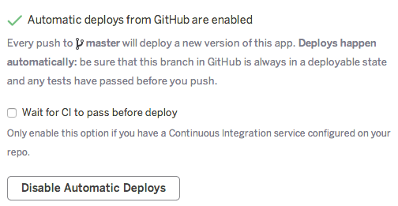

# Starter Kit django-heroku
For those who need a Django project ready to deply on Heroku.

## Step 1. Clone the project
`$ git clone https://github.com/MhamedBendenia/django-heroku-starter-kit.git`

## Step 2. Install dependencies
```
$ cd django-heroku-starter-kit
$ pip install -r requirements.txt
```

## Step 3. Config Heroku
1- First of all, create a Heroku account: https://signup.heroku.com/

2- Login into your account
`$ heroku login`

3- Create an app on Heroku
`$ heroku create project_name`

4- Configure GitHub integration in the Deploy tab of apps in the Heroku Dashboard. 
<p align="center"></p>     


5- Enable automatic deploys for a GitHub branch.    
<p align="center"></p>  

## Step 4. Commit your work then push it
```
$ git add .
$ git commit -m "My first Heroku app"
$ git push origin master
```

## Check your deployed app 
The link should be : https://<project_name>.herokuapp.com/  
Check the deployed app for this project: https://django-heroku-starter-kit.herokuapp.com/
